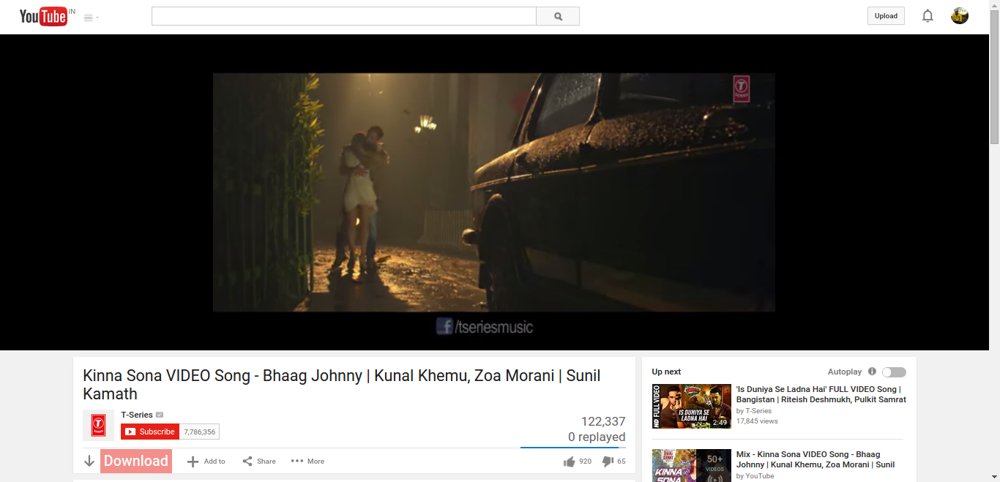

##Screenshot?

## How to use?
* [Download](https://github.com/akashnimare/youtube-dl/archive/master.zip) this repo, unzip the files.
* Open (chrome://extensions/) or select the menu Window > Extensions.
* Enable the developer mode at top right.
* Click Load unpacked extension... and select the source code folder.
*Boom!
